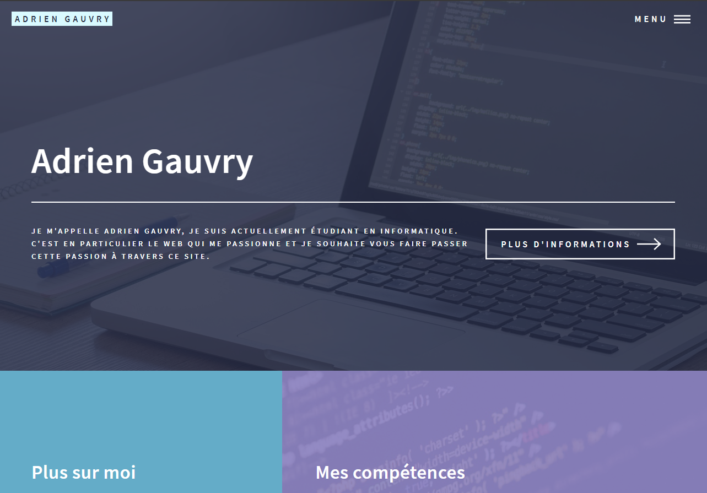
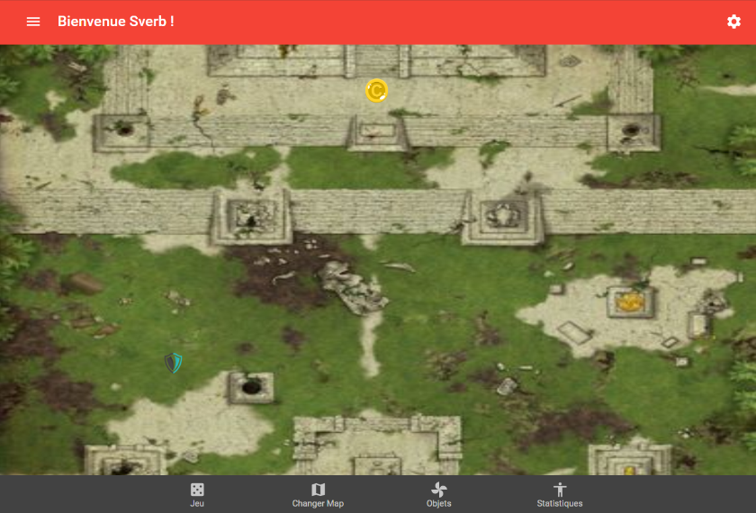
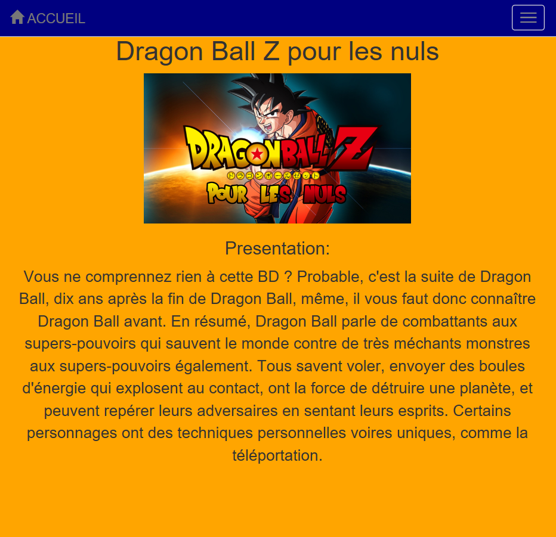

<!-- Main -->

<!-- One -->
<section id="one">
	

		<header class="major">
			<h2>Mes projets :</h2>
		</header>
		
Vous trouverez ici les projets, soit personnels, soit réalisés pendant mon cursus. Tous les projets réalisés en DUT ont été réalisés en binôme voir plus.

	

</section>

<!-- Two -->
<section id="two" class="spotlights">
	<section>
		
		

			

				<header class="major">
					<h3>Mon site</h3>
				</header>
				
Et oui, après tout le site sur lequel vous vous trouvez actuellement fait parti de mes réalisation. Je l'ai réalisé avec Jekyll qui est un générateur de site statique avec le thème Forty. Cela permet de créer un site avec un bon design assez simplement.

				<ul class="actions">
					<li><a href="https://github.com/adriengauvry/adriengauvry.github.io" target="_blank" class="button">Voir le projet sur Github</a></li>
				</ul>
			

		

	</section>
	<section>
		
		

			

				<header class="major">
					<h3>Icosaèdre deliquescent</h3>
				</header>
				
Sans doute le plus gros projet sur lequel j'ai eu l'occasion de travailler. Icosaèdre deliquescent est une application web qui a pour but la gestion de parties de jeu de rôle. Nous étions 5 personnes à participer à ce projet. Je me suis occupé avec une autre personne de la partie front-end de l'application. Ce projet m'a permis de découvrir React, associé à Material UI qui permet d'utiliser la norme material design de Google. Ce projet a permis d'améliorer mes connaissances en matière de technologies web, en dehors des matières obligatoires dans le programme du DUT.

				<ul class="actions">
					<li><a href="https://github.com/adriengauvry/Icosaedre-Deliquescent" target="_blank" class="button">Voir le projet sur Github</a></li>
					<li><a href="https://ico-dqct.herokuapp.com" target="_blank" class="button">Tester maintenant !</a></li>
				</ul>
			

		

	</section>
	<section>
		
		

			

				<header class="major">
					<h3>Dragon Ball Z pour les nuls</h3>
				</header>
				
Un simple site vitrine one page que j'ai réalisé en première année de mon DUT afin de découvrir l'utilisation de Bootstrap

				<ul class="actions">

				</ul>
			

		

	</section>
</section>

<!-- Three -->
<section id="three">
	

		<header class="major">
			<h2>A venir ici, d'autres projets...</h2>
		</header>
	

</section>

